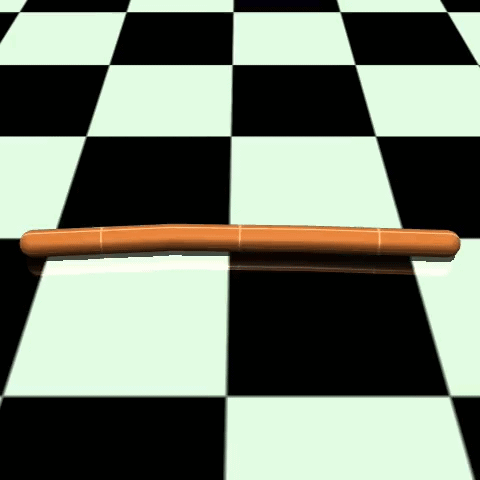
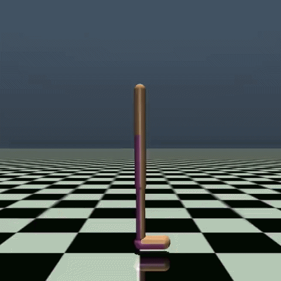
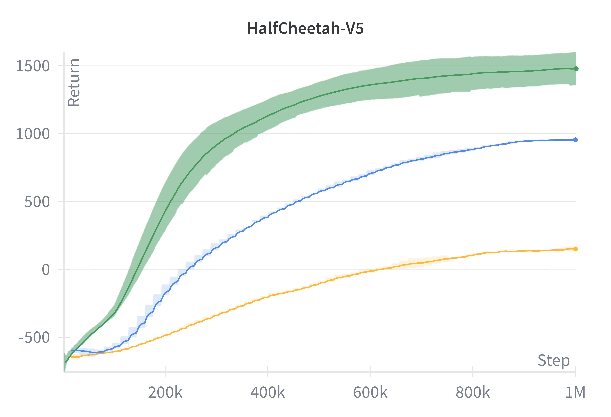
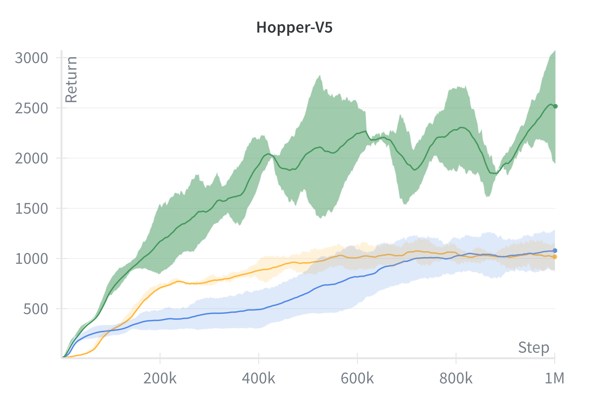
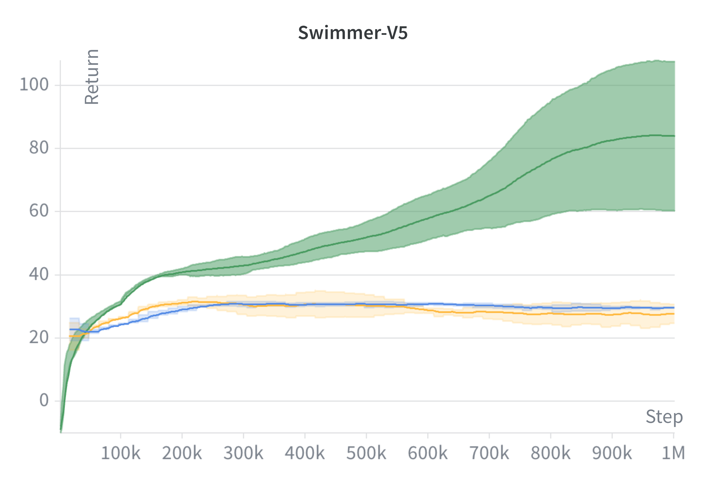
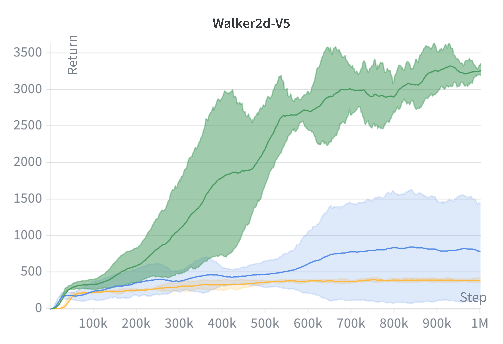

# Proximal Policy Optimization (PPO) for MuJoCo
This repository contains an implementation of **Proximal Policy Optimization (PPO)** based on the original PPO paper for continuous control tasks in **MuJoCo** environments. The implementation has been tested on **HalfCheetah**, **Swimmer**, **Hopper**, and **Walker2d** and compared with **A2C** and **Vanilla Policy Gradient (VPG)**.


<p>
  
  
  
  
</p>


## Prerequisites
1) Install UV (if you don't have it already)
```sh
curl -LsSf https://astral.sh/uv/install.sh | sh
```

2) Install dependencies
```sh
uv sync
```

3) If you want to use W&B to track training progress: Generate [W&B](https://wandb.ai/) API key, create .env file and add `WANDB_API_KEY`:
```
WANDB_API_KEY=<YOUR_API_KEY>
```

## Training
### Regular training with W&B
```sh
uv run python train.py --config config/<MUJOCO_ENV_NAME>/<a2c|ppo|vpg>.yaml
```

### Regular training without W&B
```sh
uv run python train.py --config config/<MUJOCO_ENV_NAME>/<a2c|ppo|vpg>.yaml --disable-wandb
```

### W&B sweep (runs all 3 random seeds)
```sh
wandb sweep config/<MUJOCO_ENV_NAME>/<a2c|ppo|vpg>.yaml      
wandb agent <AGENT_NAME>
```   


## Simulating
```sh
uv run python simulate.py --config config/<MUJOCO_ENV_NAME>/<a2c|ppo|vpg>.yaml --video-dir videos --episodes <NUM_EPISODES>
```

## Supported Environments
* [HalfCheetah-v5](https://gymnasium.farama.org/environments/mujoco/half_cheetah/)
* [Swimmer-v5](https://gymnasium.farama.org/environments/mujoco/swimmer/)
* [Hopper-v5](https://gymnasium.farama.org/environments/mujoco/hopper/)
* [Walker2d-v5](https://gymnasium.farama.org/environments/mujoco/walker2d/)

## Training Performance

I log **smoothed returns over the last 100 episodes** during training. Below are the learning curves of **PPO**, **A2C**, and **Vanilla PG**, averaged over 3 random seeds.

<p>
  
  
  
  
</p>

<p>
  <strong>Legend:</strong> 🟩 PPO | 🟦 A2C | 🟧 Vanilla PG
</p>

<p style="font-size:0.9em;">Comparison of PPO, A2C, and Vanilla PG algorithms on different MuJoCo environments: average return over 100 episodes, trained for 1 million timesteps.</p>

## Resources
* [Proximal Policy Optimization Algorithms, Schulman et al., 2017](https://arxiv.org/abs/1707.06347)
* [Asynchronous Methods for Deep Reinforcement Learning, Mnih et al., 2016](https://arxiv.org/abs/1602.01783)
* [MuJoCo Gymnasium Documentation](https://gymnasium.farama.org/environments/mujoco/)
